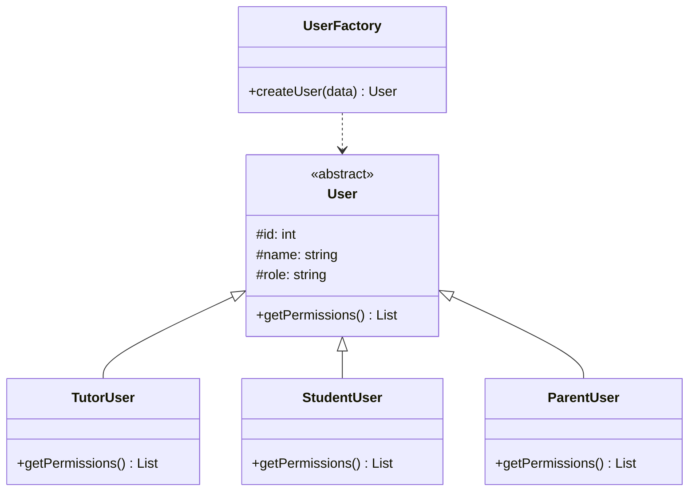
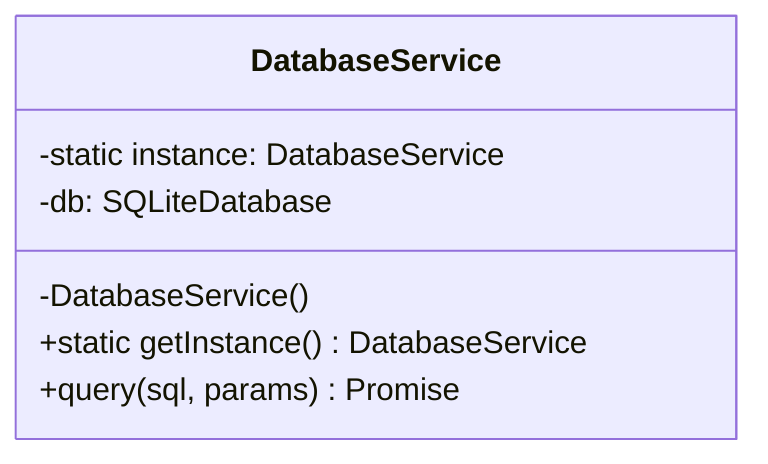
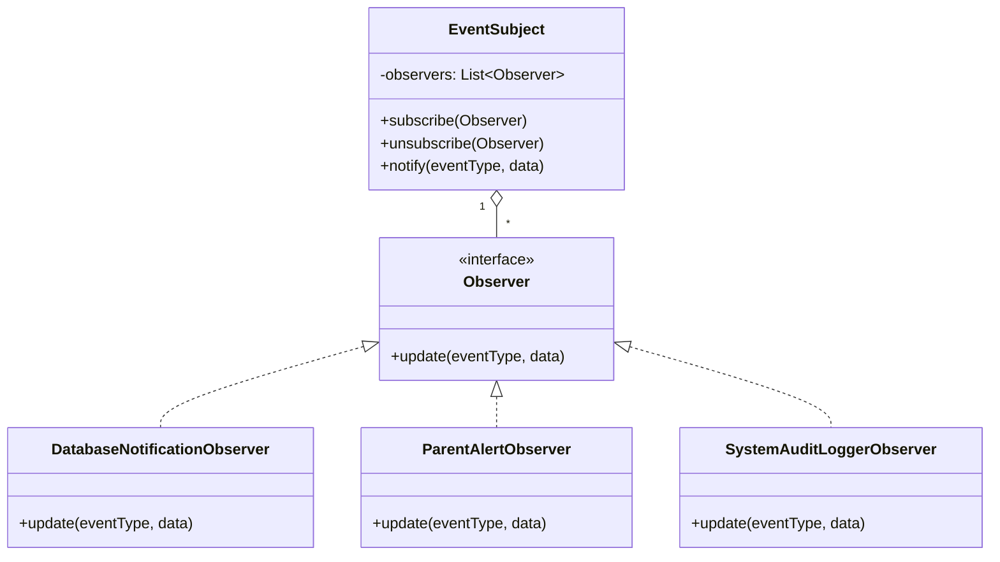
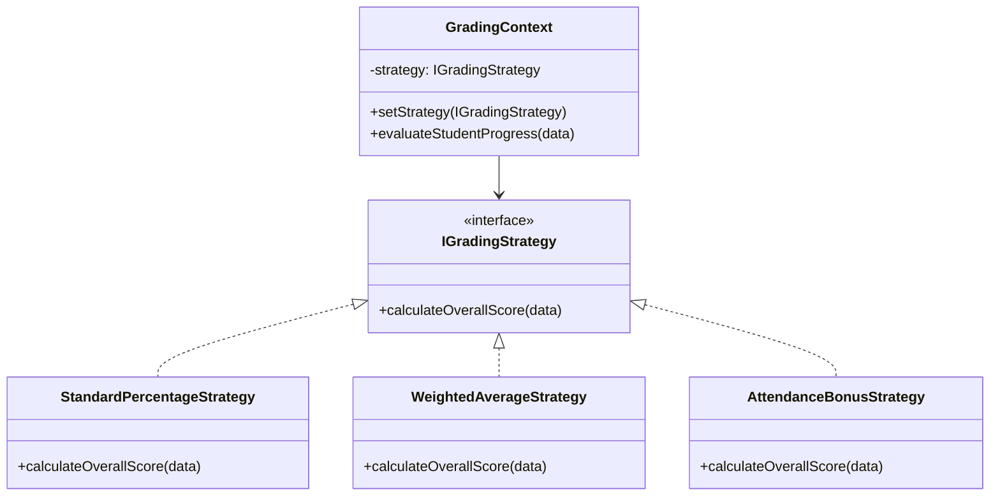

# GoF Design Patterns Implementation Documentation

This document provides a comprehensive architectural breakdown of the **8 Classic Gang of Four (GoF) Design Patterns** implemented in the **Tutor Management System (TMS)** for CSE327 Software Engineering.

---

## Summary Table of Implemented Patterns

| # | Pattern Name | Category | Primary Use Case in TMS | Backend Class | Java File |
|---|---|---|---|---|---|
| 1 | **Factory Method** | Creational | Instantiating User domain objects & Assessments | `UserFactory`, `AssessmentFactory` | `UserAndAssessmentFactory.java` |
| 2 | **Singleton** | Creational | Shared database connection manager | `DatabaseService` | `DatabaseService.java` |
| 3 | **Observer** | Behavioral | Broadcasting in-app alerts, parent notifications & audit logs | `NotificationPublisher` | `NotificationPublisher.java` |
| 4 | **Strategy** | Behavioral | Dynamic algorithms for student grade calculation | `GradingContext`, `GradingStrategy` | `GradingStrategy.java` |
| 5 | **Command** | Behavioral | Session scheduling/rescheduling with undo stack | `CommandInvoker`, `SessionCommand` | `SessionCommand.java` |
| 6 | **Facade** | Structural | Consolidating multi-subsystem queries for dashboards | `DashboardFacade` | `DashboardFacade.java` |
| 7 | **Adapter** | Structural | Standardizing Local File vs Cloud S3 storage | `StorageService`, `StorageAdapter` | `StorageAdapter.java` |
| 8 | **State** | Behavioral | Enforcing valid session lifecycle status transitions | `SessionStateContext` | `SessionState.java` |

---

## 1. Factory Method Pattern (Creational)

### Intent
Defines an interface for creating objects, allowing factory methods to decide which class to instantiate without coupling client code to concrete classes.

### UML Diagram

### Application in TMS
`UserFactory.createUser(role, data)` constructs specialized domain models (`TutorUser`, `StudentUser`, `ParentUser`) with role-specific permission arrays. `AssessmentFactory.createAssessment(type, data)` constructs `QuizAssessment` or `AssignmentAssessment` objects with specialized autograding algorithms.

---

## 2. Singleton Pattern (Creational)

### Intent
Ensures a class has only one instance throughout the application lifecycle and provides a global point of access to it.

### UML Diagram

### Application in TMS
Prevents SQLite database connection leakage and file locking conflicts by maintaining a single thread-safe instance in `backend/database/db.js` and double-checked locking in `DatabaseService.java`.

---

## 3. Observer Pattern (Behavioral)

### Intent
Defines a one-to-many dependency between objects so that when one object changes state, all its dependents are notified automatically.

### UML Diagram

### Application in TMS
When a session is created, grade published, or announcement posted, `NotificationPublisher` automatically broadcasts updates to `DatabaseNotificationObserver`, `ParentAlertObserver`, and `SystemAuditLoggerObserver`.

---

## 4. Strategy Pattern (Behavioral)

### Intent
Defines a family of algorithms, encapsulates each one, and makes them interchangeable at runtime.

### UML Diagram

### Application in TMS
Allows tutors and students to evaluate progress dynamically using `WeightedAverageStrategy` (50% Assignments, 30% Quizzes, 20% Attendance), `StandardPercentageStrategy`, or `AttendanceBonusStrategy`.

---

## 5. Command Pattern (Behavioral)

### Intent
Encapsulates a request as an object, thereby letting you parameterize clients with different requests and support undoable operations.

### Application in TMS
`ScheduleSessionCommand`, `RescheduleSessionCommand`, and `CancelSessionCommand` encapsulate session changes. The `CommandInvoker` maintains a history stack enabling **1-Click Undo** capability in the UI!

---

## 6. Facade Pattern (Structural)

### Intent
Provides a unified, simplified high-level interface to a set of interfaces in a complex subsystem.

### Application in TMS
`TutorDashboardFacade`, `StudentDashboardFacade`, and `ParentDashboardFacade` consolidate multi-table queries (batches, calendar, materials, assignments, quizzes, attendance, logs, notifications) into clean, high-performance API view models.

---

## 7. Adapter Pattern (Structural)

### Intent
Converts the interface of a class into another interface clients expect, enabling incompatible interfaces to work together.

### Application in TMS
`IStorageAdapter` standardizes file upload methods for `LocalStorageAdapter` (local filesystem) vs `MockCloudStorageAdapter` (Amazon S3 / CDN).

---

## 8. State Pattern (Behavioral)

### Intent
Allows an object to alter its behavior when its internal state changes.

### Application in TMS
`SessionStateContext` manages session status transitions (`SCHEDULED` -> `COMPLETED`, `CANCELLED`, `RESCHEDULED`), enforcing valid state transition rules.
